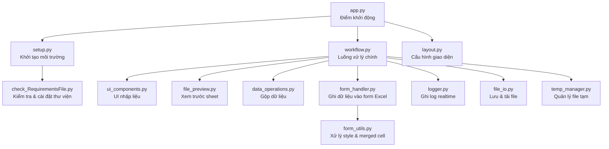
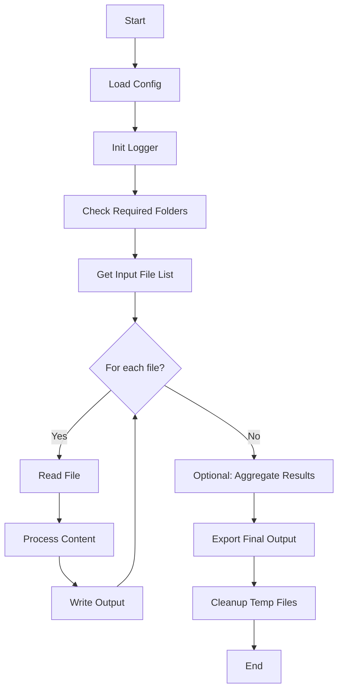

# Project Tool Cho Công Việc - Python

## Giới thiệu
Dự án này tập hợp các công cụ hỗ trợ xử lý dữ liệu. Các chức năng được thiết kế để tự động hóa quy trình, giảm sai sót và tiết kiệm thời gian.

## Các chức năng chính

### 1. Gộp file Excel

# 📘 Excel Combine Tool

## 1. Giới thiệu

**Excel Combine Tool** là ứng dụng Streamlit hỗ trợ:

- Upload nhiều file Excel  
- Chọn sheet, chỉnh sửa dữ liệu  
- Gộp dữ liệu từ nhiều file/sheet  
- Xuất file Excel mới hoặc ghi vào form có sẵn  
- Ghi log realtime trên giao diện web  
- Tự động kiểm tra & cài đặt thư viện  

Ứng dụng được chia thành nhiều module nhỏ để dễ bảo trì và mở rộng.

---

## 2. Kiến trúc tổng quan

### 🧩 Sơ đồ kiến trúc (Mermaid)

---

## 3. Mô tả từng module

### 📌 app.py – Điểm khởi động chính

- Khởi tạo giao diện Streamlit  
- Khởi tạo logger  
- Kiểm tra môi trường  
- Gọi workflow chính  

**Hàm chính:**

| Hàm | Chức năng |
|-----|-----------|
| `main()` | Điều phối toàn bộ ứng dụng |

---

### 📌 logger.py – Hệ thống log realtime

- Tạo vùng log cố định  
- Ghi log theo thời gian thực  
- Không in ra CMD  
- Dễ mở rộng  

**Hàm chính:**

| Hàm | Chức năng |
|-----|-----------|
| `init_logger()` | Tạo vùng log |
| `log(msg)` | Ghi log |
| `clear_log()` | Xóa log |

---

### 📌 setup.py – Khởi tạo môi trường

- Gọi hàm kiểm tra thư viện

---

### 📌 check_RequirementsFile.py – Kiểm tra & cài đặt thư viện

- Đọc requirements.txt  
- Kiểm tra thư viện đã cài chưa  
- Tự động cài đặt nếu thiếu  
- Xử lý đặc biệt cho pywin32  

---

### 📌 workflow.py – Luồng xử lý chính

- Upload file  
- Chọn sheet  
- Chỉnh sửa dữ liệu  
- Xem trước form  
- Nhập dòng bắt đầu/kết thúc  
- Gộp dữ liệu  
- Ghi vào form  

---

### 📌 ui_components.py – Thành phần UI tái sử dụng

- Upload file  
- Chọn sheet  
- Chỉnh sửa dataframe  

---

### 📌 file_preview.py – Xem trước dữ liệu

- Lấy danh sách sheet  
- Đọc sheet thành DataFrame  

---

### 📌 data_operations.py – Gộp dữ liệu

- Gộp dữ liệu từ nhiều file/sheet  
- Áp dụng dòng bắt đầu  
- Áp dụng chọn cột  

---

### 📌 file_io.py – Lưu file & tải xuống

- Lưu file Excel  
- Tải file xuống  
- Ghi dữ liệu vào form bằng openpyxl  

---

### 📌 form_handler.py – Ghi dữ liệu vào form Excel bằng COM

- Kiểm tra & cài đặt pywin32  
- Mở Excel thật bằng COM  
- Xóa vùng body  
- Chèn dòng  
- Ghi dữ liệu  
- Lưu file  

---

### 📌 form_utils.py – Xử lý style & merged cell

- Copy style dòng  
- Ghi giá trị vào merged cell  

---

### 📌 temp_manager.py – Quản lý file tạm

- Tạo file tạm  
- Xóa file tạm  

---

### 📌 layout.py – Cấu hình giao diện

- Set page config  
- Tiêu đề ứng dụng  

---

## 4. Luồng xử lý tổng thể

---

## 5. Ghi chú bảo trì

- Không sửa `logger.py` nếu không cần  
- Nếu thay đổi UI → sửa `workflow.py` và `ui_components.py`  
- Nếu thay đổi logic gộp → sửa `data_operations.py`  
- Nếu thay đổi cách ghi form → sửa `form_handler.py`  
- Nếu thêm thư viện → cập nhật `requirements.txt`  

Xem hướng dẫn sử dụng tại: [User Guide](Documents/USER_GUIDE.md)
---

